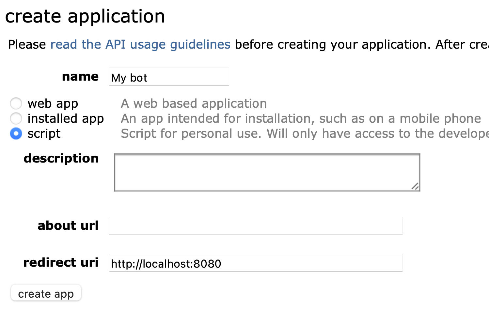
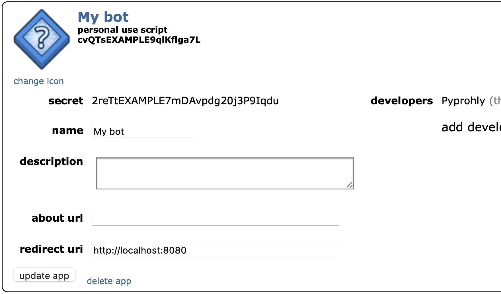

=============
Authorization
=============

Accounts
--------

Reddit does not have a distinct account type for bots, and there is nothing
special about bot accounts on Reddit; they are just regular user accounts
operated by a computer program. For accounts specifically made for bot use,
it is customary to create an account with the term 'Bot' in the name.

During your bot-building journey you'll most likely need to create lots of test
content on Reddit. Rather than gunking up your main account or even your
planned bot account, it may be a good idea to make a completely separate
account specifically for testing.

.. tip::
   On Reddit you can create multiple accounts using the same email address.

A Reddit account isn't needed to use this library if you're only interested
in reading data.

The client constructor
----------------------

Reddit uses OAuth2 for authorisation, and RedditWarp generally requires you
provide your credentials to connect to the API. You supply your credentials to
the RedditWarp client constructor.

The client constructor overloads are shown in the library code excerpt below.

::

   @overload
   def __init__(self) -> None: ...
   @overload
   def __init__(self, client_id: str, client_secret: str, /) -> None: ...
   @overload
   def __init__(self, client_id: str, client_secret: str, /, *, grant: AuthorizationGrant) -> None: ...
   @overload
   def __init__(self, client_id: str, client_secret: str, refresh_token: str, /) -> None: ...
   @overload
   def __init__(self, client_id: str, client_secret: str, username: str, password: str, /) -> None: ...

The most typical ways to instantiate the client will be using the zero, two, or
three positional argument forms::

   Client()
   Client(CLIENT_ID, CLIENT_SECRET)
   Client(CLIENT_ID, CLIENT_SECRET, REFRESH_TOKEN)

The zero-argument constructor provides read-only access to the Reddit API. The
intended use case for this is for testing things out in an interactive command
line REPL session, or demonstrating a short-running sample script. When you
don't specify credentials, RedditWarp will use its own embedded credentials.

So the code below will work as is without any prior configuration.

::

   import redditwarp.SYNC
   client = redditwarp.SYNC.Client()
   subm = next(client.p.front.pull.hot(amount=1))
   print("r/{0.subreddit.name} | {0.id36}+ ^{0.score} | {0.title!r:.80}".format(subm))

It is recommended you obtain your own OAuth2 credentials so that you can
authorise on your own behalf for programs such as bots and big data scrapers.

Client credentials
------------------

Client credentials consist of two parts: a *client ID* and a *client secret*.

The typical incantation for instantiating a read-only client instance on your
own behalf is by passing your client credentials like so::

   CLIENT_ID = '...'
   CLIENT_SECRET = '...'
   client = redditwarp.SYNC.Client(CLIENT_ID, CLIENT_SECRET)

The resulting client effectively behaves exactly like the zero-argument form:
it lacks a user context and is effectively read-only.

Obtaining client credentials
~~~~~~~~~~~~~~~~~~~~~~~~~~~~

Client credentials are obtained by creating an OAuth2 app profile on Reddit.

1. Head over to the
   `developer apps page <https://www.reddit.com/prefs/apps/>`_
   and click :guilabel:`create app...` at the bottom.

2. Enter some name for your app, like `My bot`.

3. Select :guilabel:`script` as the app type.

4. For the redirect URI enter ***exactly*** `http://localhost:8080`.

.. raw:: html

   

Don't worry about entering anything incorrectly, the information can be changed
later.

Press :guilabel:`create app`.

.. raw:: html

   

The two alphanumeric strings (which may contain hyphens and underscores) are
your client credentials. The one in bold at the top is your client ID and the
other one is the client secret.

Grant credentials
-----------------

If you want to use the API through a user context, and gain write access,
you'll additionally need to provide grant credentials.

Grants credentials come in many forms, but a refresh token is the prefered
grant credential to use.

Obtaining a refresh token
~~~~~~~~~~~~~~~~~~~~~~~~~

Follow these steps to obtain a refresh token.

1. Run the following command::

   $ python -m redditwarp.cli.refresh_token

2. Enter your *client ID* and *client secret* as prompted.

3. The script should launch a web browser and navigate to a Reddit page that
   lists the permissions that the generated token will be granted.
   Click :guilabel:`allow`.

4. Return to the terminal to see the newly generated OAuth2 tokens.

5. **Copy the refresh token down somewhere safe.**

The access token is a byproduct of obtaining a refresh token in the token
obtainment process. Just ignore it and it will expire by itself after a day.

Copy the refresh token down to a safe place.
**Do not lose it**.
The refresh token is not shown again.
Refresh tokens expire after one year of non-use.

Generating new tokens will not invalidate the old ones.

Check that the credentials work by fetching the current user with them::

   import redditwarp.SYNC
   CLIENT_ID = '...'
   CLIENT_SECRET = '...'
   REFRESH_TOKEN = '...'
   client = redditwarp.SYNC.Client(CLIENT_ID, CLIENT_SECRET, REFRESH_TOKEN)
   me = client.p.account.fetch()
   print(f"Hello u/{me.name}!")

To revoke a refresh token, use the `redditwarp.cli.revoke_token` tool.

.. _the-praw-ini-file:

The `praw.ini` file
-------------------

.. _praw.ini: https://praw.readthedocs.io/en/stable/getting_started/configuration/prawini.html

RedditWarp supports the PRAW `configuration file format <praw.ini>`_,
`praw.ini`, through an alternative constructor, `Client.from_praw_config()`.
It searches for these files in the same locations PRAW does.

Only a subset of the usual PRAW configuration keys are read:

* `client_id`
* `client_secret`
* `refresh_token`
* `username`
* `password`
* `user_agent`

Here is an example of a `praw.ini` file.

.. code-block:: ini

   [DEFAULT]
   client_id = cvQTsEXAMPLE9qlKflga7L
   client_secret = 2reTtEXAMPLE7mDAvpdg20j3P9Iqdu
   user_agent = u_SuvaBot by u/Pyprohly

   [SuvaBot]
   refresh_token = 69268695264-IAyOnEXAMPLEkHXsdi9aMdULbIvFJi

.. note::
   Recall how INI files work:

   * The fields in the `DEFAULT` section are applied to all sections.
   * Section names are case sensitive, but not key names.
   * Do not put quotes around values.

If you're on Windows, place the `praw.ini` file in the `%APPDATA%` directory.
If you're on macOS, place it at `~/.config/praw.ini`.

Now you can easily create client instances with and without user contexts::

   client1 = redditwarp.SYNC.Client.from_praw_config('SuvaBot')
   print(client1.p.account.fetch().name)

   client0 = redditwarp.SYNC.Client.from_praw_config('')
   client0.p.account.fetch()  # Error: no user context

.. tip::
   The empty string is an alias for `DEFAULT`.
